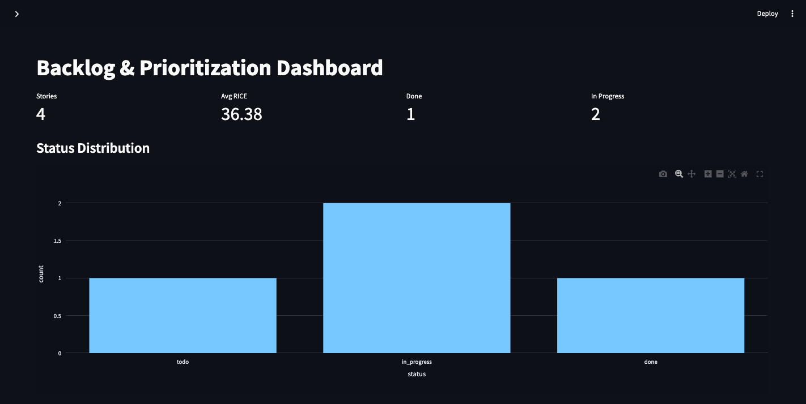
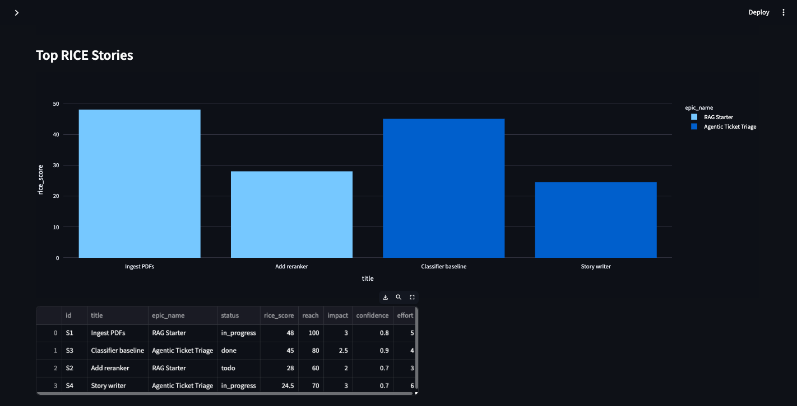
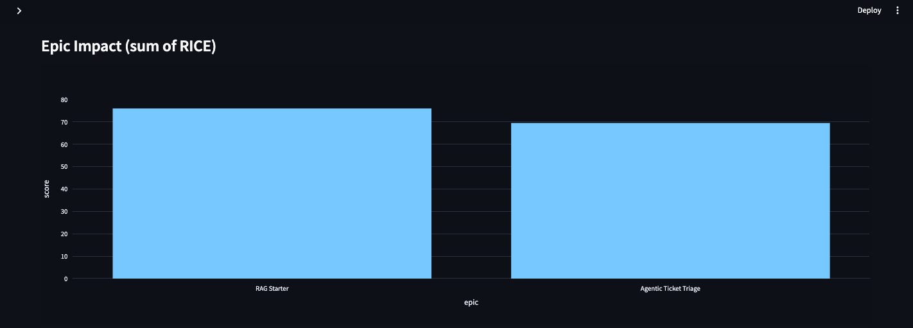
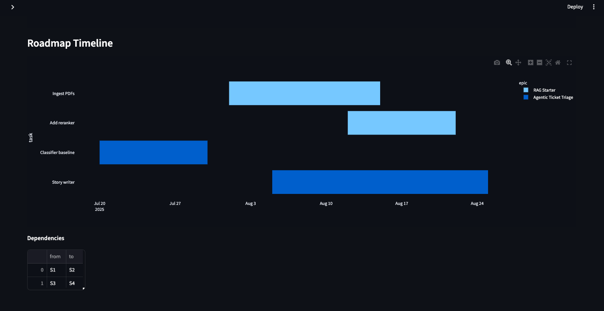

# Backlog & Prioritization Sandbox

End-to-end, dockerized system to:
- Capture Epics/Stories in YAML
- Compute and visualize **RICE** ranked backlog
- Track **progress** and **impact metrics**
- Generate an automatic **Roadmap timeline** (Gantt)
- Export to GitHub (placeholder endpoint ready)

## Quick start (local)
```bash
pip install -r requirements.txt
export BACKLOG_PATH="$(pwd)/backlog.yaml"
uvicorn services.api.main:app --reload --port 8000
streamlit run apps/dashboard/streamlit_app.py
```

API at http://localhost:8000, Dashboard at http://localhost:8501

## Docker Compose
```bash
docker compose -f infra/docker-compose.yml up --build
```
Then open http://localhost:8501

## Repo layout
```
apps/
  rice_cli/
  dashboard/
services/
  api/
infra/
  docker-compose.yml
tests/
  test_rice.py
docs/
  PRD.md
backlog.yaml
```

## Acceptance criteria
- RICE ranking available via `/ranked`
- Dashboard shows status, top RICE, epic impact
- Roadmap timeline grouped by epic


## Streamlit App output




